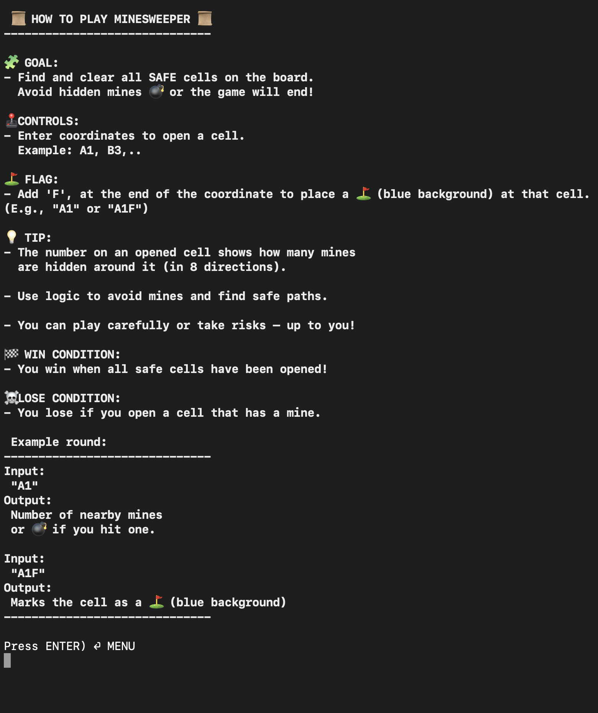
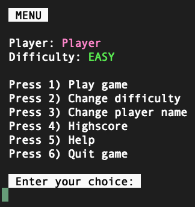
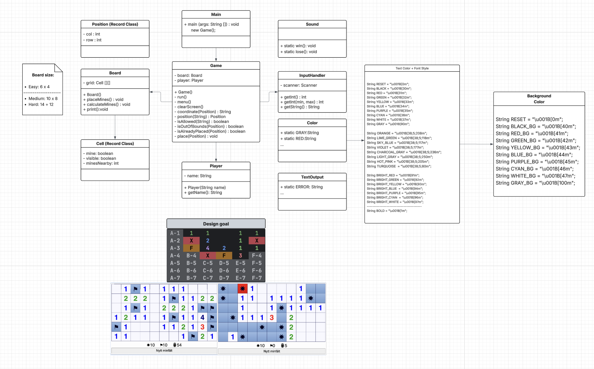
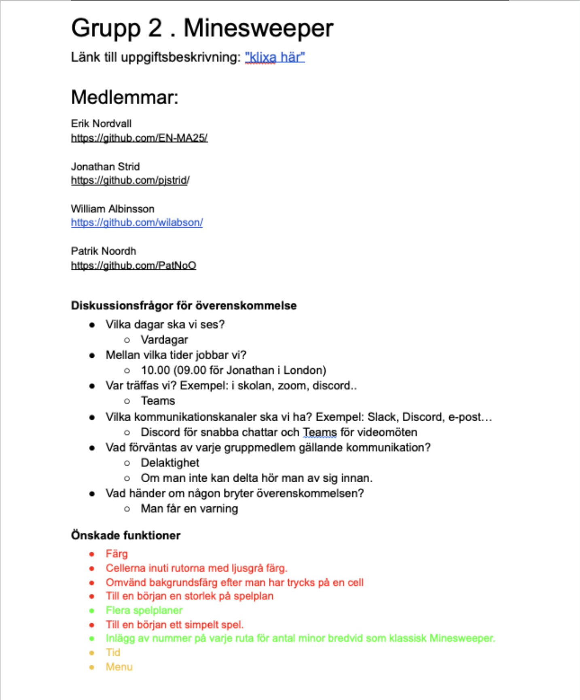
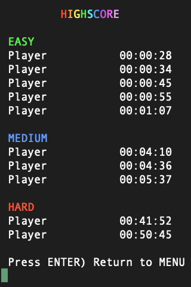
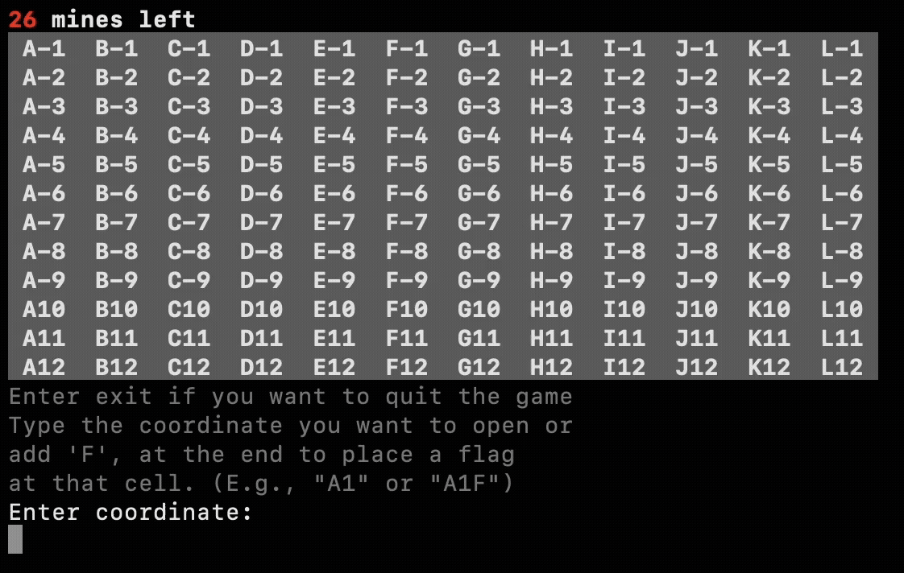
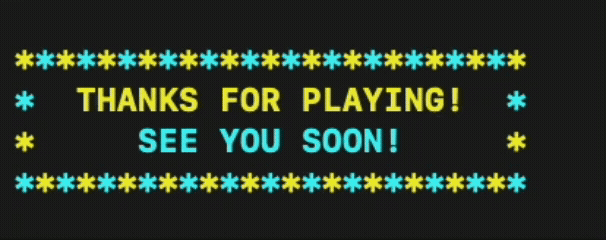

# 💣 Minesweeper Madness

**Minesweeper Madness** is a classic console-based Minesweeper game developed in **Java (IntelliJ IDEA)**.
It runs directly in the terminal and lets players enter their name, choose a difficulty level,
and play using colorful, text-based visuals.

 

---

## 🎯 Purpose

The purpose of this project was to develop a fully playable version of the classic **Minesweeper** game, based on our initial design idea and plan.  
Throughout the project, we focused on applying **object-oriented programming (OOP)** principles, writing **clean and structured code**,
and creating a **colorful and engaging** player experience.

In addition to the technical work, the project emphasized **collaboration using Git**.  
Each group member worked in separate **branches**, regularly merging updates through **pull requests**,
to ensure a clear and professional workflow.

---

## 📜 Features

- **Main menu** with options:
    - Play the game
    - Change difficulty (EASY, MEDIUM, HARD)
    - Change player name
    - View help instructions
    - Quit the game

- **Three difficulty levels:**
    - **EASY:** 8×8 grid with ~10 mines
    - **MEDIUM:** 12×12 grid with ~26 mines
    - **HARD:** 20×20 grid with ~80 mines

- **Colored console output** using ANSI escape codes for better visual feedback
- **Flag system (F)** to mark suspected mines
- **Recursive cell opening** for empty spaces
- **Win/Lose screens** with clear, colorful messages

---

### 🧩 Game Rules
- Type a coordinate like `A1` to open a cell.
- Add an **F** at the end (e.g., `A1F`) to place a **flag**.
- The number in a revealed cell shows how many mines are nearby.
- You **win** when all safe cells are opened.
- You **lose** if you open a cell that contains a mine 💥.

---

## ▶️ How to Run

1. Open the project in **IntelliJ IDEA** or any Java IDE.
2. Make sure the JDK (Java Development Kit) is installed and configured.
3. Run the `Main.java` file.
4. The game will launch in the **terminal window**.

---

## 🕹 How to Play

1. Run the program by executing `Main.java`
2. Enter your player name when prompted.
3. Choose from the main menu:

---

## 🔖 UML Diagram

The UML diagram was created using Lucidchart and represents the foundational structure of the Minesweeper game.
It illustrates our initial design thoughts and how the core components interact.
The diagram includes:

---

## 🧠 Classes and Structure

| Class            | Responsibility                                                                  |
|------------------|---------------------------------------------------------------------------------|
| **Main**         | Starts the game                                                                 |
| **Game**         | Handles menus, game loop, and difficulty settings                               |
| **Board**        | Creates and manages the game board                                              |
| **Cell**         | Represents an individual grid cell                                              |
| **Player**       | Stores player name and difficulty                                               |
| **Position**     | Represents a cell's coordinates on the board                                    | 
| **InputHandler** | Handles user input and validation                                               |
| **TextOutput**   | Manages all printed text and UI messages                                        |
| **Color**        | Contains ANSI color codes for console output                                    |
| **CVS**          | Reads from and writes to CSV files,  used for storing player scores or logs |
|                  |                                                                                 |

---

## 📝 Contract 

This document outlines the initial collaboration plan for – **Minesweeper**.
The agreement serves as a foundation for organizing tasks and
maintaining effective communication during the project.

---

## ⚙️ Technical Details

- **Language:** Java
- **Execution:** Command line / Terminal
- **Libraries:** None (pure Java)

---

## 🧾 Example Gameplay

  

  
  

;

---

## 🤝 Creators

**Created by:**
- [Erik Nordvall](https://github.com/EN-MA25)
- [Jonathan Strid](https://github.com/pjstrid)
- [William Albinsson](https://github.com/wilabson)
- [Patrik Noordh](https://github.com/PatNoO)

---

## 📄 License

Minesweeper Madness was built for fun and learning.  
You’re free to explore the code and play the game.

--- 
 ## 🖐

