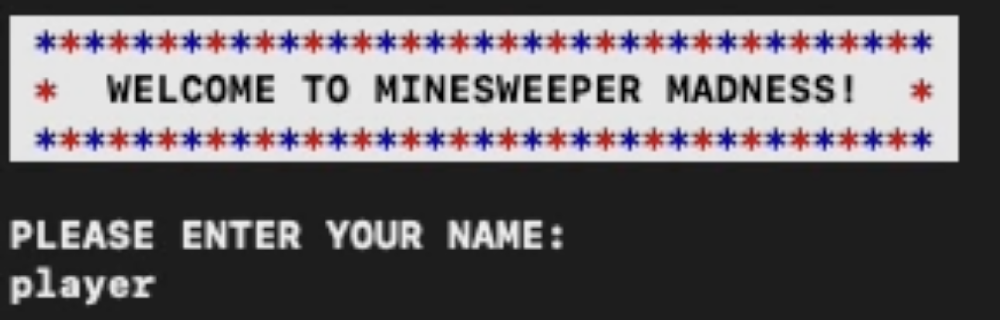
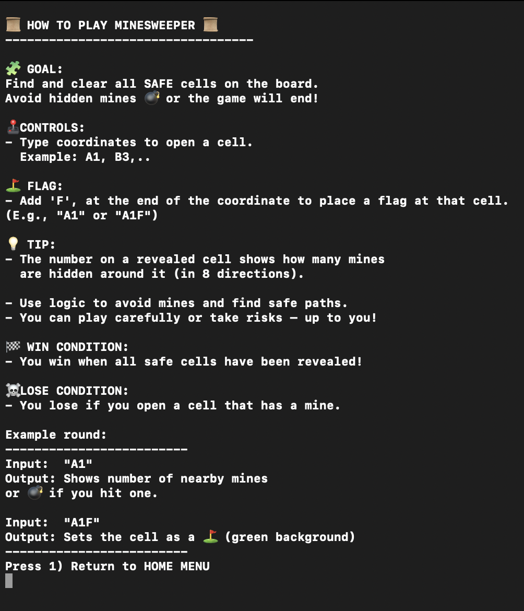
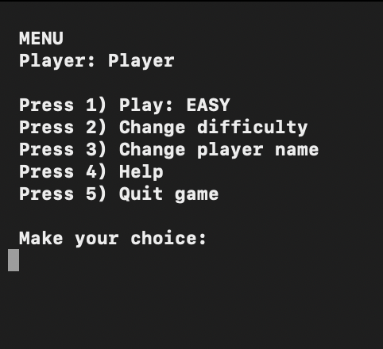
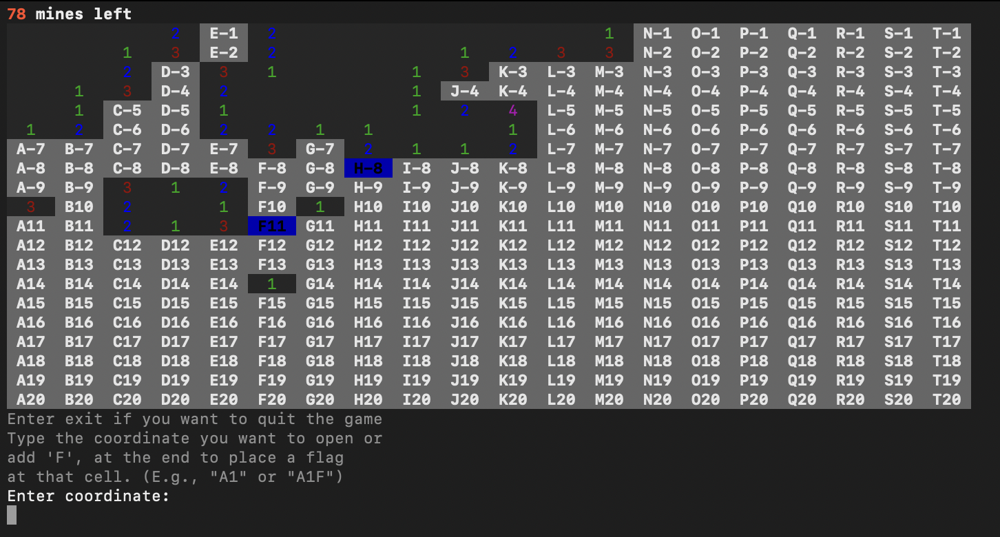
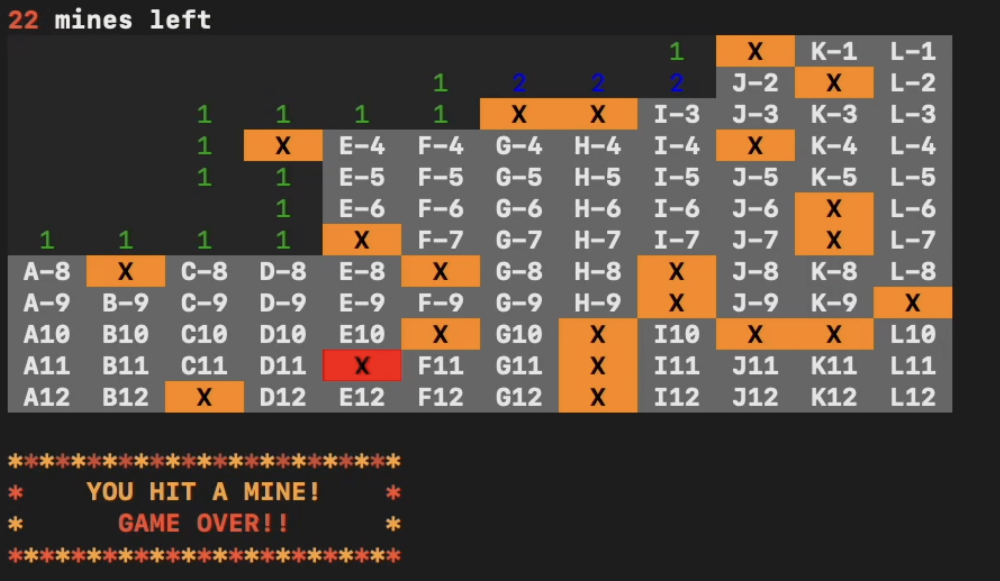
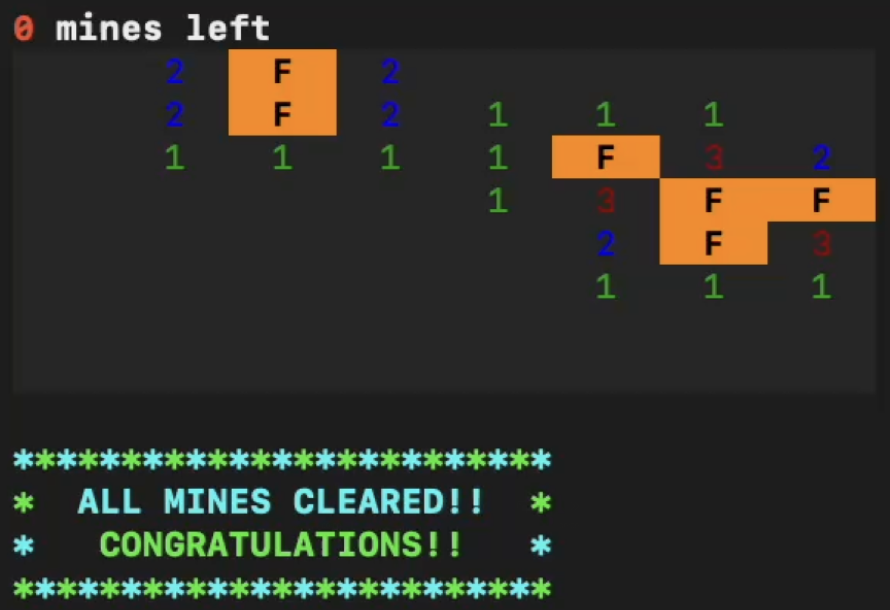

# 💣 Minesweeper Madness

A classic **console-based Minesweeper game** developed in **Java** using **intellij**.  
The game is text-based and runs directly in the terminal and allows the player
to enter their name, select a difficulty level, and play using colorful visual elements.

 

---

## 🎯 Purpose

Create a Classic MineSweeper game but with a touch of color based madness.
And write clean and easy to understand code and code structure.

---

## 📜 Features

- **Main menu** with options:
    - Play the game
    - Change difficulty (EASY, MEDIUM, HARD)
    - Change player name
    - View help instructions
    - Quit the game

- **Three difficulty levels:**
    - **EASY:** 8×8 grid with ~10 mines
    - **MEDIUM:** 12×12 grid with ~22 mines
    - **HARD:** 20×20 grid with ~80 mines

- **Colored console output** using ANSI escape codes for better visual feedback
- **Flag system (F)** to mark suspected mines
- **Recursive cell opening** for empty spaces
- **Win/Lose screens** with clear, colorful messages

---

### 🧩 Game Rules
- Type a coordinate like `A1` to open a cell.
- Add an **F** at the end (e.g., `A1F`) to place a **flag**.
- The number in a revealed cell shows how many mines are nearby.
- You **win** when all safe cells are opened.
- You **lose** if you open a cell that contains a mine 💥.

---

## 🕹 How to Play

1. Run the program by executing `Main.java`
2. Enter your player name when prompted.
3. Choose from the main menu:

---
## 🔖 UML-Diagram

The UML diagram was created using Lucidchart and represents the foundational structure of the Minesweeper game.
It illustrates our initial design thoughts and how the core components interact.
The diagram includes:

---

---
## 🧠 Classes and Structure

| Class            | Responsibility                                    |
|------------------|---------------------------------------------------|
| **Main**         | Starts the game                                   |
| **Game**         | Handles menus, game loop, and difficulty settings |
| **Board**        | Creates and manages the game board                |
| **Cell**         | Represents an individual grid cell                |
| **Player**       | Stores player name and difficulty                 |
| **InputHandler** | Handles user input and validation                 |
| **TextOutput**   | Manages all printed text and UI messages          |
| **Color**        | Contains ANSI color codes for console output      |
|                  |                                                   |

---

## 📝 Contract 
This document outlines the initial collaboration plan for – **Minesweeper**.
The agreement serves as a foundation for organizing tasks and
maintaining effective communication during the project.

---

## ⚙️ Technical Details

- **Language:** Java
- **Execution:** Command line / Terminal
- **Libraries:** None (pure Java)

---

## 🧾 Example Gameplay

  
  

  
  

